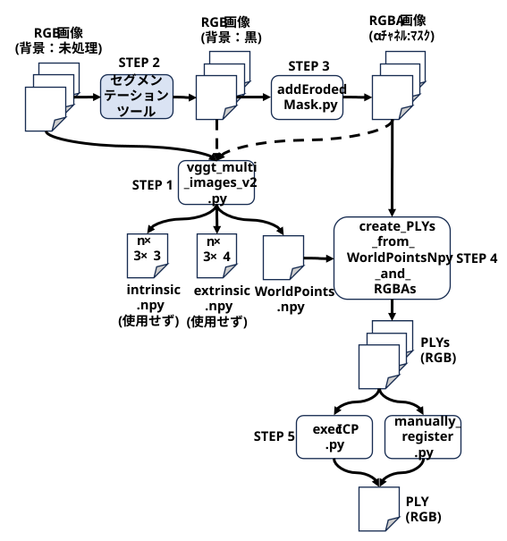
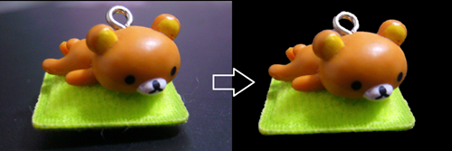
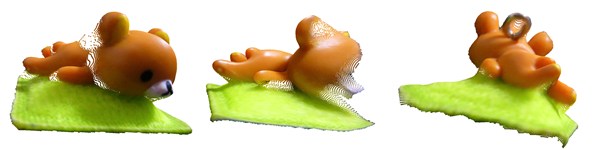
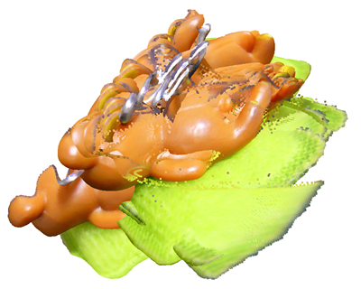
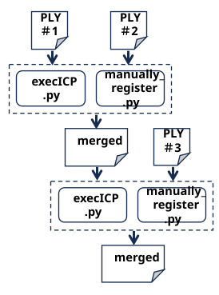

<html lang="ja">
    <head>
        <meta charset="utf-8" />
    </head>
    <body>
        <h1>
VGGT をMulti View Stereoとして使う
</h1>
        <h2>なにものか？</h2>
        

            VGGTに複数枚の画像を入力して3Dモデルを作るプログラムです。 
             
           ・(project) <a href="https://vgg-t.github.io/">https://vgg-t.github.io/</a> 
           ・(paper)   <a href="https://arxiv.org/abs/2503.11651">https://arxiv.org/abs/2503.11651</a> 
           ・(code)     <a href="https://github.com/facebookresearch/vggt">https://github.com/facebookresearch/vggt</a> 
           ・(demo)    <a href="https://huggingface.co/spaces/facebook/vggt">https://huggingface.co/spaces/facebook/vggt</a> 
             
DepthAnythingV3などを試した結果を取り込んでワークフローを見直しした。

<h3>　STEP.1　VGGTを使ってRGB画像群から点群を作成する</h3>

　　python src2\vggt_multi_images_v2.py (RGB画像群へのワイルドカード) 
 
　　RGB画像群を入力すると, ピクセルのワールド座標(WorldPoints.npy) を生成してくれる。 

　　※ WorldPoint.ply を出力しない事以外は, vggt_multi_images.py と同じ。 
 
　　Worldpoints[i][y][x][j] 
　　・i: 画像番号 
　　・y：ピクセル座標 
　　・x：ピクセル座標 
　　・0～2：ワールド座標(x,y,z)

<h3>　STEP.2　セグメンテーションツールを使って背景を黒くする</h3>

　　パワポでも何でも構わないので背景を黒くする。

<h3>　STEP.3　背景を黒くしたRGB画像群から, RGBA画像群を作成する</h3>

　　python src2\addErodedMask.py　(背景を黒くしたRGB画像群へのワールドカード)　[(侵食量：奇数整数値)] 
 
　　※ 境界の点群の色が背景色に汚染されるので, 侵食量を調整して境界の点を削る。

<h3>　STEP.4　WorldPoints.npy と RGBA画像群から PLYファイルを作成する</h3>

　　python src2\create_PLYs_from_WorldPointsNpy_and_RGBAs.py (WorldPoints.npy) （RGBA画像群へのワイルドカード) 

　　VGGTに入力した画像毎に, 背景が削除された点群のPLYファイル群が生成される。

<h3>　STEP.5　位置合わせを行い, 点群をマージする[未完]</h3>

　　単純にマージすると･･･ 
　　python src2\o3d_display_multiple_plys.py *.ply

　　ICP または 手動で位置合わせを行う。 
　　python src2\execICP.py (PLYファイル1) (PLYファイル2) 
　　python src2\manually_register.py (PLYファイル1) (PLYファイル2) 
 
　　多数のPLYの位置合わせは困難･･･

<h3>　STEP.6　PLYを表示する</h3>

　　python src2\o3d_display_ply.py (PLYファイル) 
 
　　・<strong>マウスドラッグ</strong>：　点群の回転 
　　・<strong>ホイールボタン＋マウスドラッグ</strong>：　点群の移動 
　　・<strong>`@`キー, '['キー</strong>：　表示画角変更 
　　・<strong>'-'キー,'＾'キー</strong>：　点群のサイズ変更 
　　・<strong>pキー</strong>：　スクリーンキャプチャー 
　　・<strong>1/2/3キー</strong>：　点群の回転,　<strong>＋Shiftキー</strong>：　逆回転,　<strong>＋Ctrlキー</strong>：　回転量10倍 
　　・<strong>4/5/6キー</strong>：　点群の平行移動,　<strong>＋Shiftキー</strong>：　逆方向に行移動　<strong>＋Ctrlキー</strong>：　移動量10倍 
　　・<strong>7キー</strong>：　回転ステップを下げる,　<strong>＋Shiftキー</strong>：　回転ステップを上げる 
　　・<strong>8キー</strong>：　平行移動ステップを下げる,　<strong>＋Shiftキー</strong>：　平行移動ステップを上げる 
　　・<strong>ESCキー</strong>:　終了　

<h2>環境構築方法</h2>
        

            ※ 『VGGTを単一画像深度推定器として使う』と同じです。 
　　　　 
            ● githubからVGGTのコードをダウンロードする 
            　<a href="https://github.com/facebookresearch/vggt"?>https://github.com/facebookresearch/vggt</a> 
            　Code → Download ZIP 
             
            ● vggt-main.zip を解凍する 
             
            ● 学習済モデルパラメータをダウンロードし vggt-main フォルダに配置する  
            　<a href="https://huggingface.co/facebook/VGGT-1B/blob/main/model.pt2">https://huggingface.co/facebook/VGGT-1B/blob/main/model.pt (5.03GB)</a> 
            　download をクリックする 
             
            ● Python 動作環境を構築する 
            　・pip install opencv-python 
            　・pip install torch torchvision torchaudio  
            　　GPUの場合は<a href="https://pytorch.org/">https://pytorch.org/</a> に従って PyTorch 2.xをインストールする 
            　・pip install gradio 
            　・pip install trimesh 
            　・pip install matplotlib 
            　・pip install scipy 
            　・pip install einops 
            　・pip install open3d 
        

    </body>
</html>
